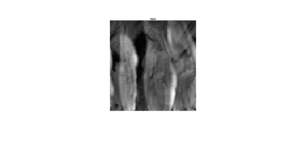
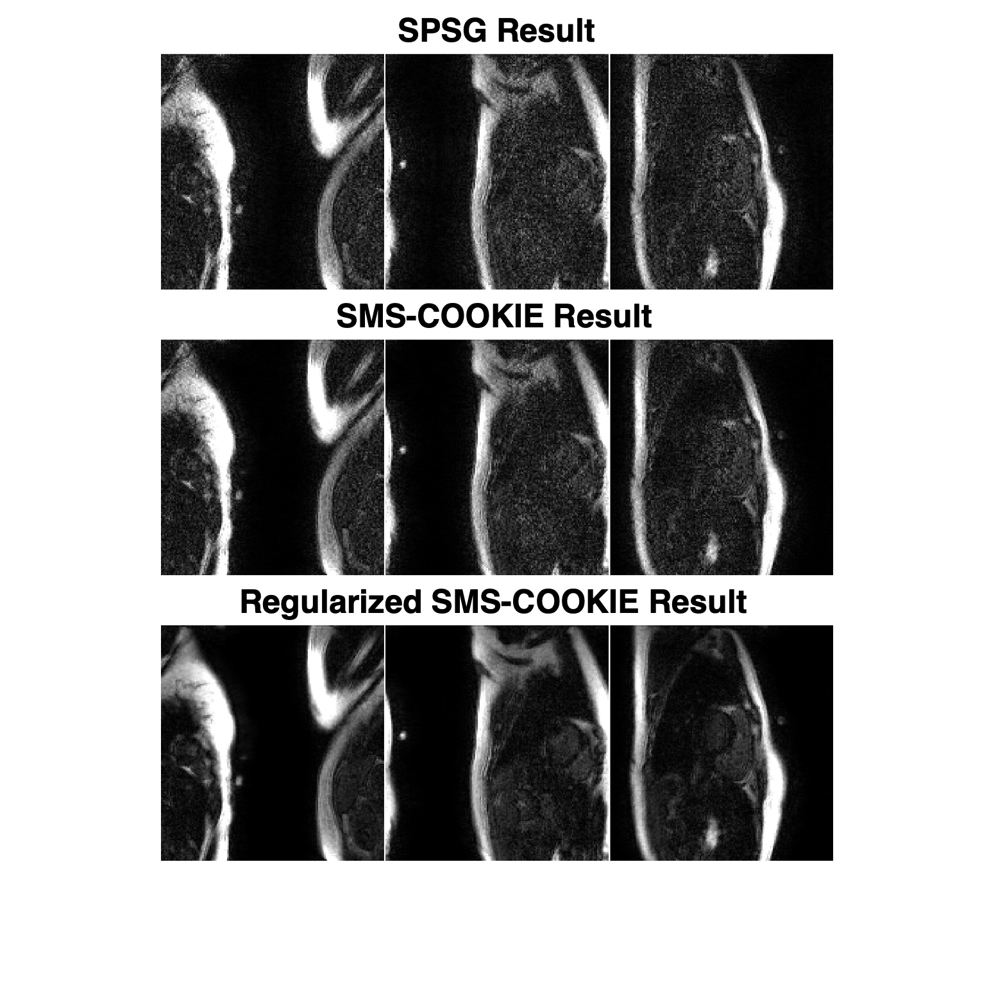

# SMS_COOKIE
This is an implementation of Composition of k-space Interpolations (SMS-COOKIE) (Demirel et al 2023).

© 2023 Regents of the University of Minnesota

SMS-COOKIE is copyrighted by Regents of the University of Minnesota. Regents of the University of Minnesota will license the use of SMS-COOKIE solely for educational and research purposes by non-profit institutions and US government agencies only. For other proposed uses, contact umotc@umn.edu. The software may not be sold or redistributed without prior approval. One may make copies of the software for their use provided that the copies, are not sold or distributed, are used under the same terms and conditions. As unestablished research software, this code is provided on an "as is'' basis without warranty of any kind, either expressed or implied. The downloading, or executing any part of this software constitutes an implicit agreement to these terms. These terms and conditions are subject to change at any time without prior notice.

Please cite the following:

Demirel OB, Weingärtner S, Moeller S, Akçakaya M. Improved Simultaneous Multi-slice Imaging with Composition of k-space Interpolations (SMS-COOKIE) for Myocardial T1 Mapping . PLoS One, 2023

To run this code, please use main.m

RO:       # of readout lines,
PE:       # of phase encode lines,
NO_C:     # of coil elements,
Slices:   # of slices,
Dynamics: # of cardiac phases,

Input data: (The data shared in the "data" folder only contains 7 T1 dynamics, the original data contains 15. Due to limited data size for Github upload, only is shared here. Please contact with us for the full 15 phase.)
- kspace (RO x PE x NO_C x Dynamics)
- acs (RO x PE x NO_C x Sices) with CAIPI shifts

Input data (shown in image domain, 1st T1 phase of the SMS acquisition):

Output data:
- spsg_res_all (RO x PE x Slices x Dynamics) % Split Slice-GRAPPA output
- sms_cookie_res_all (RO x PE x Slices x Dynamics) % SMS-COOKIE output
- sms_cookie_reg_res_all (RO x PE x Slices x Dynamics) % Regularized SMS-COOKIE output

Output data - Resuls (shown in image domain for split Slice-GRAPPA, SMS-COOKIE and regularized SMS-COOKIE):

SMS-COOKIE
- Input: raw k-space, sensitivity maps, SMS-COOKIE kernels, split Slice-GRAPPA reconstructed k-space, kernel sizes,
         slice acceleration, #of CG iterations
- Output: reconstructed k-space, reconstructed SENSE-1 Images
         
Regularized ROCK-SPIRiT
- Input: raw k-space, sensitivity maps, SMS-COOKIE kernels, split Slice-GRAPPA reconstructed k-space,  kernel sizes,
         slice acceleration, #of CG iterations, # of ADMM loops
- Output: reconstructed kspace, reconstructed SENSE-1 Images

Regularization:
- Locally low rank (LLR) regularization is supported via ADMM in regularized SMS-COOKIE
- To avoid border artifacts, CAIPIRINHA shifts are re-shifted/shifted before/after the regularization

